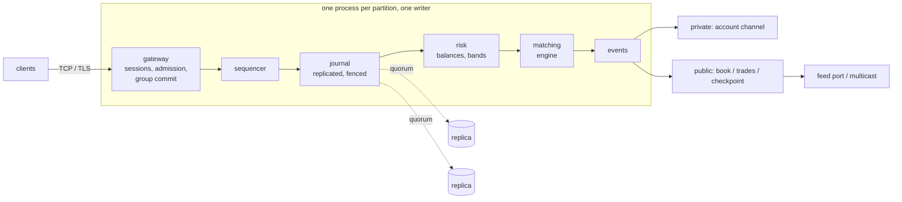

<h1 align="center">exchange-core</h1>

<p align="center">
  A crypto exchange core in Rust — matching, journaling, market data, replication and failover.<br>
  Single-writer, deterministic, and durable by quorum rather than by disk.
</p>

<p align="center">
  <a href="https://github.com/hsdxpro/exchange-core/actions/workflows/ci.yml"></a>
  
  
  
  
  
</p>

<p align="center">
  <a href="#quick-start">Quick start</a> &middot;
  <a href="#architecture">Architecture</a> &middot;
  <a href="#design-decisions">Design decisions</a> &middot;
  <a href="#testing">Testing</a> &middot;
  <a href="#not-included">Not included</a>
</p>

<p align="center">
  <a href="ARCHITECTURE.md">ARCHITECTURE.md</a> &middot;
  <a href="PROTOCOL.md">PROTOCOL.md</a> &middot;
  <a href="BENCH.md">BENCH.md</a> &middot;
  <a href="DESIGN.md">DESIGN.md</a> &middot;
  <a href="ENGINEERING.md">ENGINEERING.md</a>
</p>

---

- **190 ns** for a passive limit order across the full path: sequence, journal,
  balance reservation, match, emit
- **6.6M commands/sec** durable, acknowledged by a quorum of replicas
- **66.7 µs** round trip replicated, against 357 µs for a local `fsync` —
  reaching two machines is **5.4× faster than reaching the platter**
- **1,207×** on market-data p50 by moving the audience to its own feed port;
  **0 ns** marginal cost per idle connection; **1M accounts** at 506 ns/command
- **0.9 ms** restart from a snapshot instead of 9.6 ms replaying from zero
- Ed25519 logon, TLS 1.3 for internet sessions, per-symbol and per-account kill
  switches, and an optional venue-signed hash chain a client can verify

Every number measured on the machine this was built on; `cargo x latency`
re-takes the core tables in about seven seconds. Method matters more than the
figures — [BENCH.md](BENCH.md) says how they were taken and what they are not.

## Quick start

Needs `rustup` and nothing else. `xtask` is the task runner, and CI runs the
same `cargo x` on Linux and Windows — green locally and green on a runner
cannot become two different things.

```bash
cargo x           # format, clippy -D warnings, all 478 tests
cargo x latency   # reproduces BENCH.md's command-path and durability tables
```

Run it as a real venue and measure it:

```bash
cargo run --release -p bx-gateway --bin venue -- --config bench.conf
cargo run --release -p bx-gateway --bin load -- 127.0.0.1:7070 --clients 32
```

Run it replicated — start followers first, then list them in `venue.conf`:

```bash
cargo run --release -p bx-gateway --bin replica -- 127.0.0.1:7201
```

Two configs, because a benchmark and a deployment want opposite things:
`venue.conf` is the deployment shape (auth required, a real rate limit, journal
on disk), so pointing `load` at it measures those three, not the venue.
Differences are stated in the files; `load` says so out loud rather than
inventing a number if the venue refuses.

### Where each claim is enforced

| Claim | Enforced by |
|---|---|
| Crash recovery reproduces the last committed state, order for order | seeded crash simulation — `pipeline/tests/simulation.rs` |
| A snapshot restart equals a full replay, queue position included | `pipeline/tests/snapshot.rs` |
| Failover loses nothing acknowledged | real processes: leader killed mid-session, empty-log node promoted at a higher term, checked against every ack — `gateway/tests/failover.rs`, `machine_down.rs` |
| A replaced leader cannot write | term fencing — `journal/src/replication.rs` |
| Authentication end to end | bare-nonce, half-signature, replayed logon, revoked key all refused over real sockets — `gateway/tests/admission.rs` |
| Restrictions stop new risk, never reducing it | every restriction checked both ways, surviving snapshot and replay — `pipeline/tests/risk.rs` |
| The chain is a client's evidence, not the venue's assertion | heads recomputed client-side; reorder and insert both change them — `pipeline/tests/chain.rs` |
| Idle connections cost nothing | fails if 256 idle cost more than one — `gateway/tests/idle_cost.rs` |
| The shipped binaries match the shipped configs | `venue` + `load` run as a pair — `gateway/tests/shipped_binaries.rs` |
| Torn records, slow clients, cancel-on-disconnect | real TCP — `gateway/tests/over_tcp.rs` |

## Architecture



```text
crates/engine/     Matching engine. No dependencies, forbid(unsafe_code).
crates/protocol/   Wire records: fixed 64-byte layouts, asserted at compile time.
crates/journal/    Append-only log, replay, replication with term fencing.
crates/pipeline/   Sequencer, accounts, books, events, snapshots.
crates/gateway/    Framing, sessions, admission, group commit, TCP server, config.
crates/election/   Leader election, on a log the orders never touch.
xtask/             Task runner.
```

No crate on the matching path has a dependency it could reach; the engine
stands alone. Everything after the sequencer is a deterministic function of the
sequenced stream — no clock, no randomness, no map order reaching output — so
replay is recovery, not approximation. The ack means received-and-durable, not
accepted; a group's events are released only after its commit.

[ARCHITECTURE.md](ARCHITECTURE.md) has the crate map, a command's path through
the code, threads, state and the invariants a change must not break.
[DESIGN.md](DESIGN.md) has the reasoning; [ENGINEERING.md](ENGINEERING.md) the
rejected alternatives and the bugs that changed the design.

## Design decisions

| Decision | Why |
|---|---|
| **One unencrypted TCP transport**, TLS 1.3 as a second door | Nothing between a market maker and the book. QUIC was built and removed: 38.6 µs against TCP's 8.6 µs. Internet sessions get `tls_listen` (rustls, 1.3 only); past the record layer the doors are identical. |
| **One thread, no async runtime** on the matching path | Matching is a sequential dependency: each order changes what the next sees. More cores = more partitions (processes), not threads. |
| **The band is the price ladder's window bound** | An instrument's band is policy up to 2^31 ticks (`ceiling_ticks`); the book's level tables boot 65,536 ticks wide and grow to cover only the span where prices rest. One mechanism is still both the fat-finger control and the memory statement. |
| **The journal is the only source of truth** | Everything else is derived; recovery is snapshot load + replay. |
| **Nothing acknowledged before it is durable** | On a majority of replicas, not a platter — that is the 103× at group 1. |
| **No secret exists to steal** | Ed25519 challenge: the venue holds public keys only; reading its config yields nothing signable. |
| **A session acts for one account** | The account it proved, or the one its first command claimed. Without the binding, one valid credential traded every account. |
| **Restrictions stop new risk, never reducing it** | Halted symbols and stopped accounts still take cancels; `CancelAll` is unprivileged so a lost client can flatten itself. |
| **Order IDs increase per account** | At most one attempt can ever be live, so a client that lost its connection can retry safely. `DuplicateOrderId` = live now; `OrderIdNotIncreasing` = landed and finished. |
| **Batching is the default shape, not a mode** | A group is whatever arrived since the last pass — grows under load, falls to one when idle. That is where the gap between 317/sec and 6.6M/sec durable comes from. |
| **Cancel-on-disconnect is opt-in** | A market maker needs quotes pulled; a week-long limit order does not. |
| **Failover needs no person** | `openraft` runs a separate leadership log; what crosses into the venue is the term, which is a fencing token by construction. |
| **STP cancel-newest** | The resting order was there first — CME SMP and Binance `EXPIRE_TAKER` default. |
| **MBP only — no order-by-order feed** | MBO leaks trading patterns and is 10–100× the volume; depth, BBO and an anonymous tape are what the venue states. |

## Verifiable ordering

Optional, off by default, +25 ns a command, +17 ns more signed. The journal
keeps a running SHA-256, sealed every 1,024 records, published on a
`checkpoint` channel with the venue's Ed25519 signature over it. A client that
follows the stream recomputes the head and sees that its order was included
where it was told and nothing was inserted in front — *did the sequencer
front-run me* stops being a question only the venue can answer. Certificate
Transparency's shape pointed at a sequencer; cheap because the sequencer is a
single writer over fixed records. It cannot be retrofitted over an existing
journal and is refused rather than overstating what it covers.
[PROTOCOL.md](PROTOCOL.md) has the wire shape; [DESIGN.md](DESIGN.md) §3 the
two constraints learned by getting them wrong.

## Operating it

- **Reconnect**: `RESUME {channel, last_seq}` — the gap, or a restatement,
  never silence. Across a promotion it restates (channel numbering restarts
  with a venue); private outcomes an old leader acked but never reported are
  regenerated past a journalled watermark and handed to the account's next
  session, told, not queried.
- **Metrics**: `metrics_listen` serves Prometheus exposition, published on the
  venue's own cadence — never built per request, so a scraper cannot decide how
  much work the venue does. Counters are sampled every 64th pass; no clock read
  in front of an order.
- **Kill switches**: per-symbol trading state (`Trading`/`CancelOnly`/`Halted`)
  and per-account stop, admin-only, journalled, in the snapshot — a halt that
  did not survive recovery would read as a successful restart.

## Testing

478 tests. The ones worth reading are in the claims table above; the shape:

- **End-to-end with nothing faked** — simulated traders through the real API, a
  subscriber that knows only the event stream rebuilds the book from deltas and
  must equal the venue's; supply conserved, zero sequence gaps
  (`pipeline/tests/end_to_end.rs`).
- **Seeded crash simulation** — kill-and-restart with torn writes and dead
  devices, recovery order-for-order (`pipeline/tests/simulation.rs`).
- **Multi-process failover** — the shipped binaries, a killed leader, a
  promoted empty log, checked against every acknowledgement
  (`gateway/tests/failover.rs`).
- **Real-socket admission, subscription, idle-cost and churn suites** in
  `gateway/tests/`.

## Not included

Scope boundaries, with reasons rather than apologies:

- **Cross-partition balances — allotments, not a lookup.** Symbols partition
  across processes; value moves between them as a `Withdraw` sequenced in one
  journal and a `Deposit` in the other — that order deliberately, since a crash
  between the two strands funds where crediting first would mint them. The
  primitives and the conservation property are built; the settlement process
  that drives the pair is not.
- **`io_uring`.** Linux-only, and untested platform-specific I/O is worse than
  none. Batching writes recovered 8.6× without leaving `std`.
- **Client withdrawals and fees.** Venue features, not exchange-core ones.
  `Withdraw` is administrative — a client cannot send one for itself, any more
  than it can fund itself. Halts *are* here.

## Related

The matching core grew out of
[**matching-engine**](https://github.com/hsdxpro/matching-engine) — the same
bitmap ladder in Rust and C++, both verified against independent reference
models. That project is the auditable engine on its own; this is the venue
around it.

[**tick-to-trade**](https://github.com/hsdxpro/tick-to-trade) is the other side
of the wire: feed parsing, book maintenance and order entry, measured end to
end.

## License

[MIT](LICENSE)
